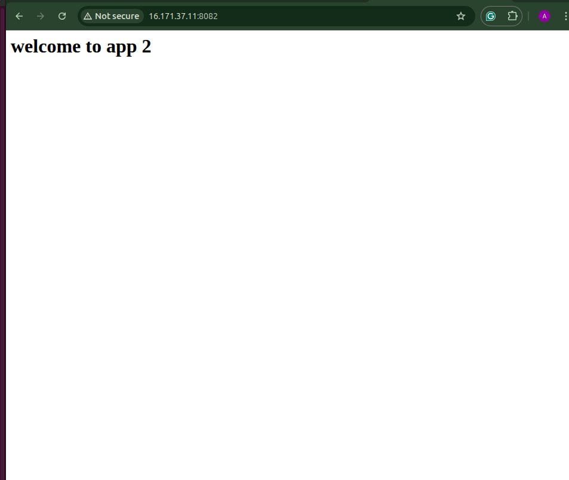

# Git & NGINX Assessment - Abhinay Pandey

## 📋 Assessment Overview
This repository contains my submission for the Git Version Control & NGINX Web Server technical assessment. All practical tasks have been completed on an Ubuntu Linux VM with comprehensive documentation and screenshots.

---


# Section A: Practical Tasks

## PRACTICAL 01 | Git Installation, Configuration & First Repository

### 1a. Install Git and Verify Version
```bash
sudo apt update
sudo apt install git -y
git --version
```
**Output:** `git version 2.43.0`


### 1b. Configure Global Git Identity
```bash
git config --global user.name "Abhinay-Pandey"
git config --global user.email "pandeyabhinay1269@gmail.com"
git config -l
```


### 1c. Create Directory and Initialize Git Repository
```bash
mkdir git-nginx-assessment
cd git-nginx-assessment/
git init
```


### 1d. Create Initial Files
```bash
echo "#Git & NGINX Assessment Name : Abhinay" > README.md
echo "print('Hello Git')" > app.py
ls
```
**Output:** `README.md  app.py`


### 1e. Stage Files and Make First Commit
```bash
git add README.md app.py
git status
git commit -m "Initial commit : Add README and app.py"
```


### 1f. View Git Log
```bash
git log
```
**Commit Hash:** `939e56934cfac37d02da82130a230a78db1d19bb`


---

## PRACTICAL 02 | Branching, Committing & Pull Request Workflow

### 2a. Create Feature Branch
```bash
git checkout -b feature/add-calculator
git branch
```


### 2b. Add Calculator Module
Created `calculator.py` with add and subtract functions:
```python
def add(a, b):
    return a + b

def subtract(a, b):
    return a - b
```

### 2c. Commit Calculator Module
```bash
git add calculator.py
git commit -m "Feat: add calculator module with add and subtract functions"
```


### 2d. Update README and Second Commit
```bash
# Updated README to mention calculator module
git add README.md
git commit -m "docs: update README to mention calculator module"
git log --oneline
```


### 2e-f. Push to GitHub and Create Pull Request
```bash
git remote add origin https://github.com/Abhinay-Pandey/git-nginx-assessment.git
git push origin feature/add-calculator
```


**GitHub Pull Request:**
- Created PR from `feature/add-calculator` to `master`
- PR shows 1 commit, 1 file changed (calculator.py)
- No conflicts with base branch


### 2g. Merge PR and Pull Locally
```bash
git checkout master
git pull origin master
git log --oneline
```
**Updated Log:**
```
24cb617 (HEAD -> master, origin/master) Merge pull request #1 from Abhinay-Pandey/feature/add-calculator
7c512ca (origin/feature/add-calculator) Feat: add calculator module with add and subtract functions
939e569 Initial commit : Add README and app.py
```


---

## PRACTICAL 03 | Stash, Undo & History (Revert, Reset, Amend)

### 3a. Stash Demo
```bash
# Create and switch to bugfix branch
git checkout -b bugfix/stash-demo

# Modified app.py by adding a comment
vim app.py
# Added: "# this is a temp change"

git stash
git status  # Shows clean working directory

git stash pop  # Restores changes
cat app.py  # Verify changes returned
```
**Stash Operation:**
- Working directory saved temporarily
- Successfully popped and restored changes


### 3b. Create Bug and Revert
```bash
# Create bug file
echo "this is a bug" > bug.txt
git add bug.txt
git commit -m "bug : add bug.txt"
git log --oneline

# Revert the bug commit
git revert HEAD --no-edit
git log --oneline
```

**Before Revert:**
```
25de6ba (HEAD -> bugfix/stash-demo) bug : add bug.txt
24cb617 (origin/master, master) Merge pull request #1
7c512ca Feat: add calculator module
939e569 Initial commit
```

**After Revert:**
```
06cabe5 (HEAD -> bugfix/stash-demo) Revert "bug : add bug.txt"
25de6ba bug : add bug.txt
24cb617 Merge pull request #1
7c512ca Feat: add calculator module
939e569 Initial commit
```


### 3c. Amend Commit Message
```bash
# Create hotfix file
echo "hotfix content" > hotfix.txt
git add hotfix.txt
git commit -m "wrong commit"
git log --oneline  # Before amend

# Amend commit message
git commit --amend -m "Fix :hotfix with corrected message"
git log --oneline  # After amend
```

**Before Amend:**
```
e0af508 (HEAD -> bugfix/stash-demo) wrong commit
06cabe5 Revert "bug : add bug.txt"
25de6ba bug : add bug.txt
```

**After Amend:**
```
e56f2a3 (HEAD -> bugfix/stash-demo) Fix :hotfix with corrected message
06cabe5 Revert "bug : add bug.txt"
25de6ba bug : add bug.txt
```


### 3d. Git Reset --soft Demo
```bash
# Create two files
echo "file one" > one.txt
git add one.txt
git commit -m "add one.txt"

echo "file two" > two.txt
git add two.txt
git commit -m "add two.txt"

# View commits
git log --oneline
# Output: 
# bfcb6f5 (HEAD -> bugfix/stash-demo) add two.txt
# aa48c8a add one.txt

# Soft reset last commit
git reset --soft HEAD~1
git status  # Shows two.txt staged and app.py modified
```


---

## PRACTICAL 04 | NGINX Static Hosting

### 4a. Install NGINX and Verify Status
```bash
sudo apt install nginx -y
sudo systemctl status nginx
sudo systemctl enable nginx
```


### 4b. Test NGINX Configuration
```bash
sudo nginx -t
```
**Output:** Configuration test successful


### 4c. Create Site Directories and HTML Files
```bash
# Create directories for both sites
sudo mkdir -p /var/www/app1.local/html
sudo mkdir -p /var/www/app2.local/html

# Create unique index.html files
echo "Welcome to app 1" | sudo tee /var/www/app1.local/html/index.html
echo "Welcome to app 2" | sudo tee /var/www/app2.local/html/index.html
```

### 4d. Create Server Block Configurations

**app1.local configuration:**
```nginx
server{
    listen 80;
    server_name app1.local;

    root /var/www/app1.local/html;
    index index.html;

    location /{
    try_files $uri $uri/ =404;
    }
}
```


**app2.local configuration:**
```nginx
server{
    listen 80;
    server_name app2.local;

    root /var/www/app2.local/html;
    index index.html;

    location / {
    try_files $uri $uri/ =404;
    }
}
```


### 4e-f. Enable Sites and Test
```bash
# Create symbolic links
sudo ln -s /etc/nginx/sites-available/app1.local /etc/nginx/sites-enabled/
sudo ln -s /etc/nginx/sites-available/app2.local /etc/nginx/sites-enabled/

# Test configuration and reload
sudo nginx -t
sudo systemctl reload nginx

# Add to hosts file
echo "127.0.0.1 app1.local app2.local" | sudo tee -a /etc/hosts

# Test both sites
curl http://app1.local
curl http://app2.local
```

**Results:**
- `curl http://app1.local`: Shows "Welcome to app 1"
- `curl http://app2.local`: Shows "Welcome to app 2"




---

## PRACTICAL 05 | Reverse Proxy with Docker Backend

### 5a. Run Docker Container
```bash
# Fix Docker permission issues
sudo usermod -aG docker $USER
newgrp docker

# Run nginx container
docker run -d -p 8080:80 --name backend-app nginx:alpine
docker ps
curl http://localhost:8080
```
**Issues Encountered:** Docker permission denied error - resolved by adding user to docker group and using `newgrp docker`.


**Note:** Tasks 5b, 5c, and 5d (creating myapp.local proxy configuration) were not completed due to time constraints.

---

## PRACTICAL 06 | SSL/TLS, Load Balancing & Merge Conflict Resolution

### 6a. Self-Signed SSL Certificate
```bash
# Generate self-signed certificate
sudo openssl req -x509 -nodes -days 365 -newkey rsa:2048 \
  -keyout /etc/ssl/private/myapp.key \
  -out /etc/ssl/certs/myapp.crt
```
**Certificate Details:**
- Country: IN
- State: MP
- City: BHO
- Organization: Abhinay Pvt Ltd
- OU: IT
- Email: mytech1269@gmail.com


### 6c. Merge Conflict Resolution

**Step 1: Create Conflict Situation**
```bash
# On master branch - update heading
git checkout master
nano README.md  # Changed to "# Git and NGINX Assessment - Main Version"
git add README.md
git commit -m "docs: update heading on main branch"

# Create and switch to conflict-demo branch
git checkout -b conflict-demo
nano README.md  # Changed to "# Git and NGINX Assessment - Conflict Version"
git add README.md
git commit -m "docs: update heading on conflict-demo branch"

# View branch history
git log --oneline
```

**Branch History:**
```
9710527 (HEAD -> conflict-demo) docs: update heading on conflict-demo branch
fe2a299 docs: update heading on main branch
eb00213 docs: update heading on conflict-demo branch
939e569 Initial commit : Add README and app.py
```


**Step 2: Attempt Merge and Resolve Conflict**
```bash
git checkout master
git merge conflict-demo
```
**Conflict Detected:** Automatic merge failed - both branches modified the same heading in README.md

**Conflict Markers:**
```
<<<<<<< HEAD
# Git and NGINX Assessment - Main Version
=======
# Git and NGINX Assessment - Conflict Version
>>>>>>> conflict-demo
```


**Step 3: Resolve Conflict**
```bash
# Open README.md and resolve conflict manually
nano README.md
# Edited to: "# Git and NGINX Assessment - Resolved Version"

git add README.md
git commit -m "fix: resolve merge conflict in README heading"
git log --oneline
```

**Final Commit History:**
```
8a8d5cd (HEAD -> master) fix: resolve merge conflict in README heading
19ecf91 (conflict-demo) docs: update heading on conflict-demo branch
fe2a299 docs: update heading on main branch
eb00213 docs: update heading on conflict-demo branch
9710527 docs: update heading on main branch
```


**Note:** Task 6b (Load Balancer Configuration) was not completed due to time constraints.
